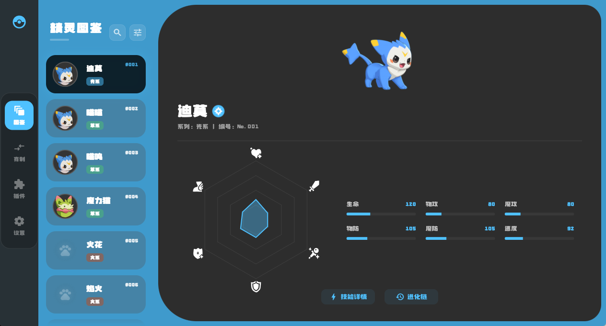
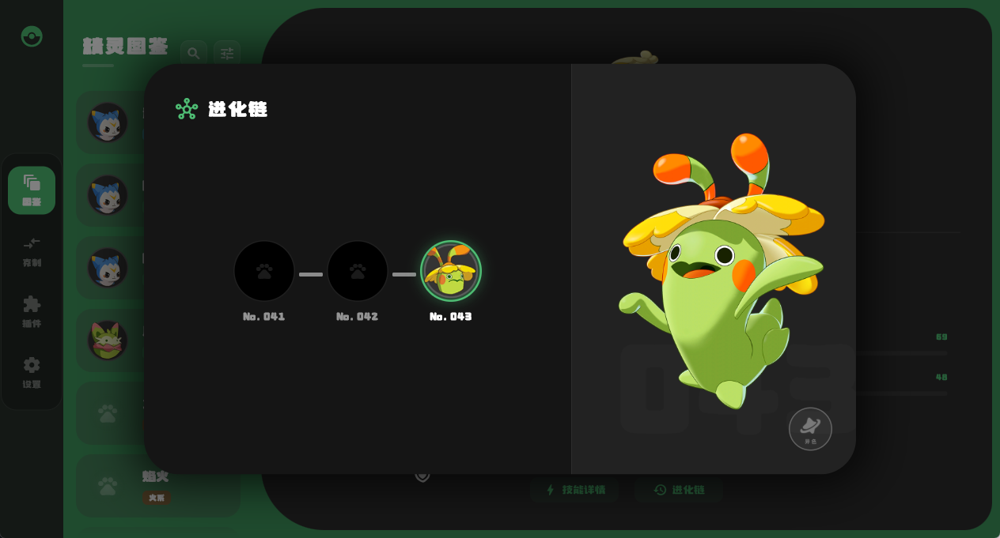
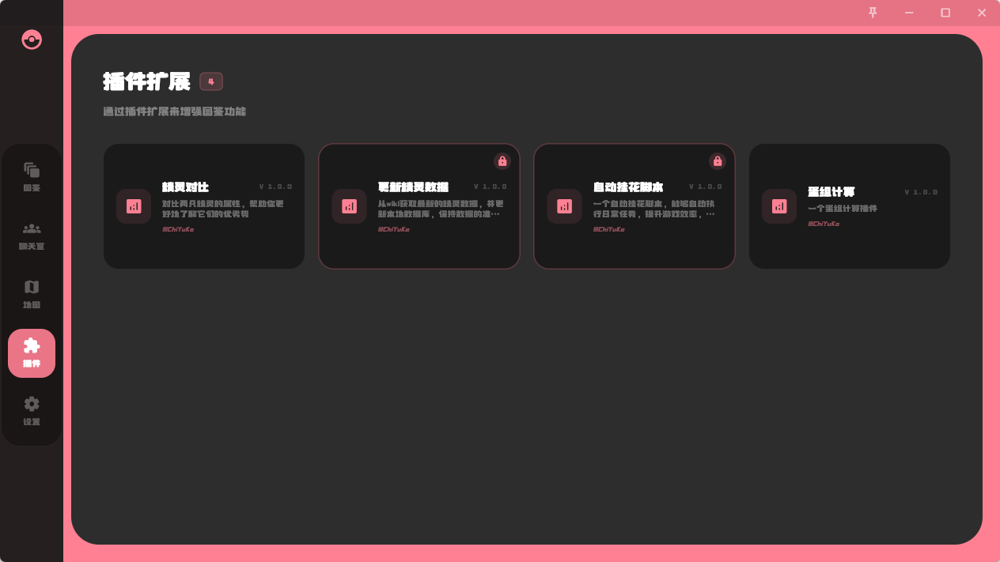
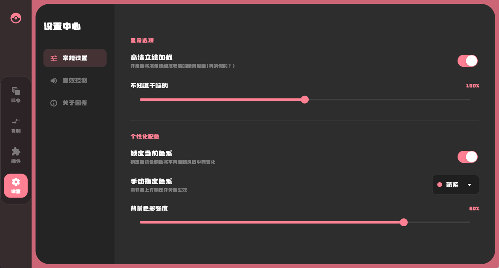
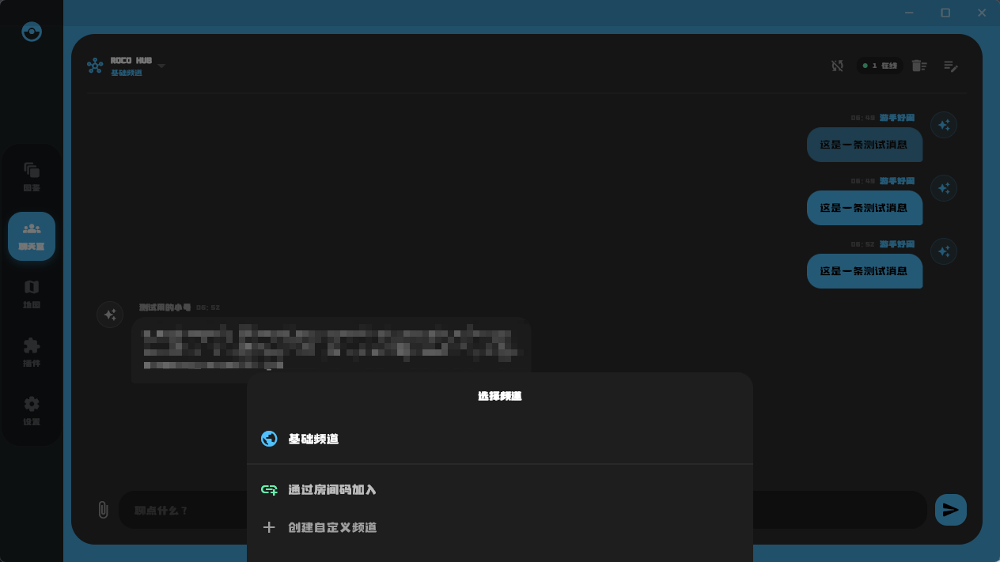

# 🎮 洛克王国盒子 (Roco Kingdom Toolbox)

一个针对《洛克王国》的多功能辅助工具，旨在提升游戏体验、整合信息与资源，为玩家提供更便捷的功能支持。

---
## 🚧 项目状态

当前处于开发阶段（WIP - Work In Progress）


## 📷 UI 预览









---


## 🛠 技术栈

* **Flutter**（跨平台 UI）
* Dart
* 本地资源管理（Assets）
* JSON 数据驱动
* isar 数据库

---

## 📁 项目结构

```bash
lib/            # 核心代码
assets/         # 图片与资源文件
android/        # Android 平台支持
ios/            # iOS 平台支持
windows/        # Windows 平台支持
web/            # Web 支持（可选）
```

---

## 🚀 快速开始

### 1️⃣ 克隆项目

```bash
git clone https://github.com/ChiYuKe/rocokingdomworldbox.git
cd RocoKingdomWorldBox
```

### 2️⃣ 安装依赖

```bash
flutter pub get
```

### 3️⃣ 运行项目

```bash
flutter run
```

## 📦 数据来源与协议

本项目部分数据与资源整理自：

* 《洛克王国：世界》相关游戏资料

---

### ⚠️ 使用说明

* 本项目仅用于学习与研究目的
* 禁止任何商业用途
* 若对数据进行修改或再分发，需遵循相同协议


---

## ⚠️ 免责声明

* 本项目为**非官方工具**，与游戏官方无任何关联
* 所有游戏相关名称、素材与版权归原作者或发行方所有。
* 本项目仅用于学习、研究与个人使用，禁止商业用途。

---

## 📌 开发计划（TODO）

* [ ] 完善图鉴数据结构
* [ ] 自动导入纹理资源
* [ ] UI 优化
* [ ] 搜索功能增强
* [ ] 支持更多游戏数据解析

---

## 🤝 贡献

欢迎提交 Issue 或 PR，一起完善这个项目！

---

## ⭐ 支持项目

如果这个项目对你有帮助，可以点个 ⭐ 支持一下！

---

## 📬 联系

如有问题或建议，欢迎反馈交流。

---

## 📄 License

- Code: GNU GENERAL PUBLIC LICENSE 3
- Data: CC BY-NC-SA 4.0
