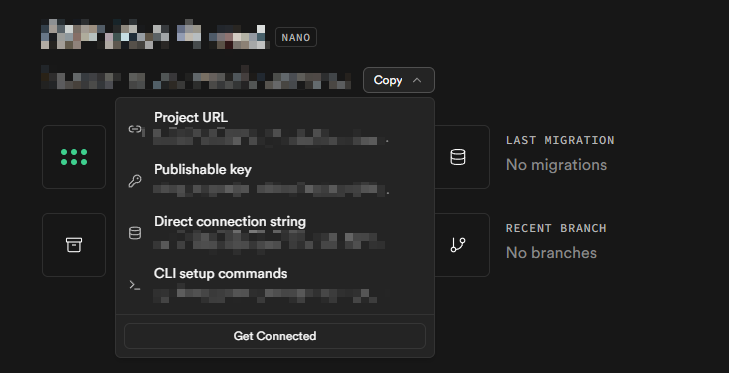

# ROCO HUB 自定义频道搭建指南

本项目提供一套基于 **Supabase** 的轻量级私有聊天频道解决方案，支持实时通信、文件传输以及“房间码”快速分享，让你可以轻松搭建属于自己的聊天环境。

---

## 功能特性

* 🔗 房间码分享 / 一键加入
* 📁 文件 & 图片上传（支持权限控制）
* 🔒 基于 RLS 的安全策略
* ⚡ 零后端部署（依赖 Supabase）

---

##  一、环境准备

在开始之前，你需要完成以下准备工作：

1. 注册并登录 [Supabase](https://supabase.com/)
2. 创建一个新的 Project
3. 获取以下信息：

   * `SUPABASE_URL`
   * `SUPABASE_ANON_KEY`
   
4. 打开项目中的 **SQL Editor**

---

##  二、数据库初始化（SQL 配置）

将完整 SQL 脚本复制到 Supabase 的 **SQL Editor** 中执行，用于初始化后端环境。

### 初始化内容包括：

* `messages` 表：存储聊天消息
* `channel_configs` 表：频道配置（权限控制等）
* Realtime：开启实时订阅
* Storage：创建 `chat` 存储桶（用于文件上传）
* RLS 策略：允许匿名访问（基础使用）

```sql
-- ==========================================
-- 1. 创建消息表 (Messages)
-- ==========================================
CREATE TABLE IF NOT EXISTS public.messages (
    id BIGINT GENERATED BY DEFAULT AS IDENTITY PRIMARY KEY,
    created_at TIMESTAMP WITH TIME ZONE DEFAULT TIMEZONE('utc'::text, NOW()) NOT NULL,
    content TEXT,
    username TEXT,
    user_id TEXT,
    pet_id INT,
    is_image BOOLEAN DEFAULT FALSE,
    reply_to JSONB,
    channel_name TEXT 
);

--  确保实时更新能推送所有字段
ALTER TABLE public.messages REPLICA IDENTITY FULL;

-- ==========================================
-- 2. 创建频道配置表 (Channel Configs)
-- ==========================================
CREATE TABLE IF NOT EXISTS public.channel_configs (
    channel_name TEXT PRIMARY KEY,
    allow_all_files BOOLEAN DEFAULT FALSE,
    allowed_machine_ids TEXT[] DEFAULT '{}',
    description TEXT
);

-- ==========================================
-- 3. 开启实时监听 (Realtime)
-- ==========================================
DO $$ 
BEGIN
  IF NOT EXISTS (SELECT 1 FROM pg_publication WHERE pubname = 'supabase_realtime') THEN
    CREATE PUBLICATION supabase_realtime;
  END IF;
END $$;

-- 使用异常处理，防止重复添加导致的报错
DO $$
BEGIN
    ALTER PUBLICATION supabase_realtime ADD TABLE public.messages;
EXCEPTION WHEN others THEN 
    RAISE NOTICE 'Table messages already in publication';
END $$;

DO $$
BEGIN
    ALTER PUBLICATION supabase_realtime ADD TABLE public.channel_configs;
EXCEPTION WHEN others THEN 
    RAISE NOTICE 'Table channel_configs already in publication';
END $$;

-- ==========================================
-- 4. 配置存储桶 (Storage)
-- ==========================================
INSERT INTO storage.buckets (id, name, public) 
VALUES ('chat', 'chat', true)
ON CONFLICT (id) DO NOTHING;

-- ==========================================
-- 5. 设置安全策略 (RLS)
-- ==========================================

-- 消息表策略
ALTER TABLE public.messages ENABLE ROW LEVEL SECURITY;
DROP POLICY IF EXISTS "Select Messages" ON public.messages;
CREATE POLICY "Select Messages" ON public.messages FOR SELECT USING (true);
DROP POLICY IF EXISTS "Insert Messages" ON public.messages;
CREATE POLICY "Insert Messages" ON public.messages FOR INSERT WITH CHECK (true);

-- 配置表策略
ALTER TABLE public.channel_configs ENABLE ROW LEVEL SECURITY;
DROP POLICY IF EXISTS "Allow public read channel_configs" ON public.channel_configs;
CREATE POLICY "Allow public read channel_configs" ON public.channel_configs FOR SELECT USING (true);

-- 存储策略 (增加 DELETE 权限，方便你清理测试数据)
DROP POLICY IF EXISTS "Public Access" ON storage.objects;
CREATE POLICY "Public Access" ON storage.objects FOR SELECT USING (bucket_id = 'chat');
DROP POLICY IF EXISTS "Public Upload" ON storage.objects;
CREATE POLICY "Public Upload" ON storage.objects FOR INSERT WITH CHECK (bucket_id = 'chat');
DROP POLICY IF EXISTS "Public Delete" ON storage.objects;
CREATE POLICY "Public Delete" ON storage.objects FOR DELETE USING (bucket_id = 'chat');

-- ==========================================
-- 6. 插入白名单数据
-- ==========================================
INSERT INTO public.channel_configs (channel_name, allow_all_files, allowed_machine_ids, description)
VALUES (
  '测试频道', -- 此处的房间名字需要与客户端一致，不一致后续也可以去自动生成后的表格中去改
  false, -- 默认 是所有人不能发送文件
  ARRAY['xxxxxxxx-xxxx-xxxx-xxxx-xxxxxxxxxxxx', ['xxxxxxxx-xxxx-xxxx-xxxx-xxxxxxxxxxxx'], 
  '用户白名单'
)
ON CONFLICT (channel_name) DO UPDATE 
SET allowed_machine_ids = EXCLUDED.allowed_machine_ids;

-- 强制刷新模式缓存
NOTIFY pgrst, 'reload schema';
```


### 后续定时任务（按自己需求）：

新增一个 SQL 脚本复制到 Supabase 的 **SQL Editor** 中执行，注意不要。


```sql

-- 开启定时任务扩展
CREATE EXTENSION IF NOT EXISTS pg_cron;
-- 开启 HTTP 请求扩展（用于调用 Storage API）
CREATE EXTENSION IF NOT EXISTS pg_net;


CREATE OR REPLACE FUNCTION public.clear_chat_data_mixed()
RETURNS void AS $$
BEGIN
    -- 1. 每15天清理一次聊天信息
    DELETE FROM public.messages 
    WHERE created_at < NOW() - INTERVAL '1 days';


    -- 如果执行这一句，房间文件发送权限配置都会消失！
    -- TRUNCATE TABLE public.channel_configs;

    -- 2.  每3天清理一次储存桶 (数据库层面)
    DELETE FROM storage.objects 
    WHERE bucket_id = 'chat' 
      AND created_at < NOW() - INTERVAL '3 days';

    -- Supabase 后台会自动根据 storage.objects 的删除来物理清理实际文件
END;
$$ LANGUAGE plpgsql;


-- 先取消之前的旧任务 (如果之前运行过名为 'weekly-chat-clean' 的任务)
DO $$
BEGIN
    IF EXISTS (SELECT 1 FROM cron.job WHERE jobname = 'weekly-chat-clean') THEN
        PERFORM cron.unschedule('weekly-chat-clean');
    END IF;
    
    IF EXISTS (SELECT 1 FROM cron.job WHERE jobname = 'daily-mixed-clean') THEN
        PERFORM cron.unschedule('daily-mixed-clean');
    END IF;
END $$;

-- 创建新任务：每天凌晨 4:00 检查并清理
SELECT cron.schedule(
    'daily-mixed-clean',   -- 任务名称
    '0 4 * * *',           -- 每天凌晨 4 点触发
    'SELECT public.clear_chat_data_mixed();'
);

```

---

##  三、客户端接入流程

### 创建频道

在 洛克王国盒子客户端中：

* 打开「选择频道」
* 点击「创建自定义频道」
* 填写以下信息：

| 字段                | 说明                         |
| ----------------- | -------------------------- |
| 频道名称              | 与数据库中 channel_configs 保持一致 |
| Project URL      | 项目地址                       |
| Publishable key | 访问密钥                     |

---

### 获取房间码

创建并连接频道后：

* 打开频道选择器
* 点击右侧「分享」按钮
* 自动复制房间码到剪贴板

---

### 加入频道

* 点击「通过房间码加入」
* 粘贴房间码
* 完成连接

---


## 五、注意事项

### 存储限制

* Supabase 免费版存储空间有限
* 建议定期清理 `chat` 存储桶

### 安全性

* 当前 RLS 策略为 **公开读写**
* 若用于正式环境，请：

  * 增加 `user_id` 校验
  * 限制写入权限

### 实时同步

确保设置：

```sql
ALTER TABLE messages REPLICA IDENTITY FULL;
```

否则可能出现：

* 实时更新不完整
* 客户端无法正确同步

---

## 适用场景

* 私人聊天服务器
* 游戏工具内嵌聊天
* 小团队即时通讯
* 无服务器快速搭建聊天系统

---

##  致谢

Powered by **Supabase**

---

## License

可根据项目需求自由使用与修改，建议保留原作者说明。

---

